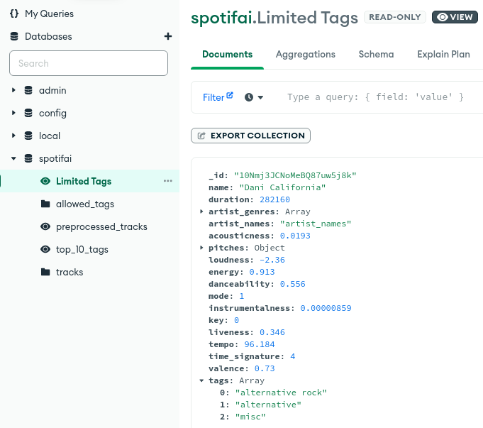
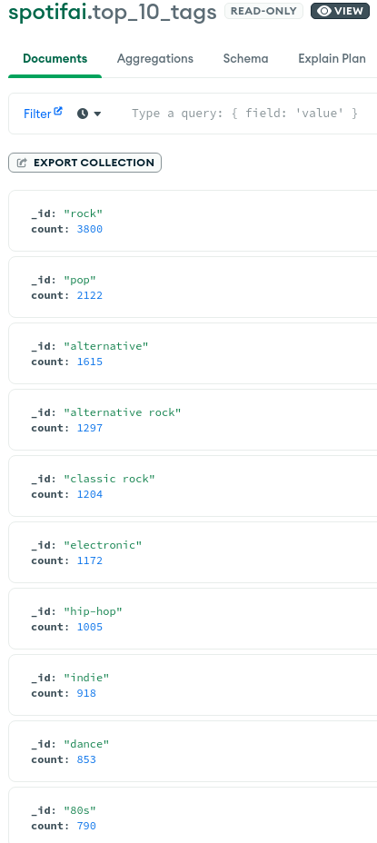
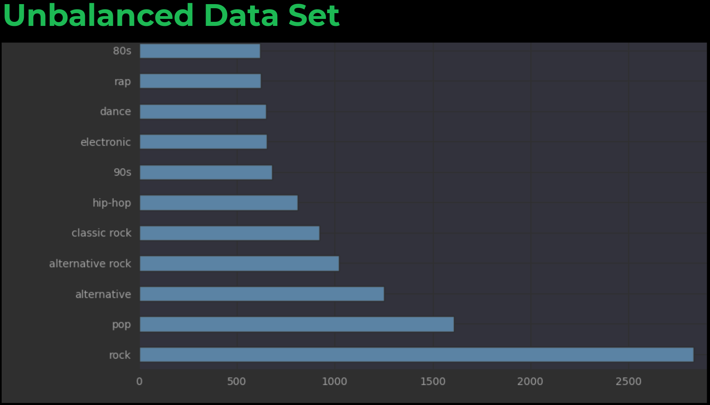
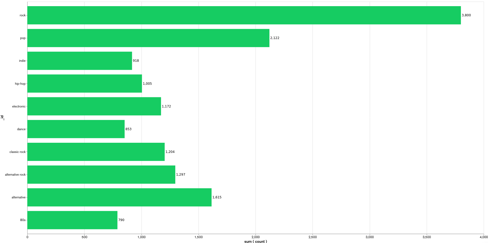

:author: Fabian H., Lea S., Andreas W., Florian W.
:listing-caption: Listing
:source-highlighter: rouge
// path to the directory containing the source code
:src: ../

:toc:
:numbered:
:toclevels: 3
:rouge-style: github
:pdf-themesdir: ./doc/theme
:pdf-theme: basic
:pdf-fontsdir: ./doc/fonts
:half-width: pdfwidth=50%
// front-cover-image can be used to include the Exercise specification, for example:
//:front-cover-image: ./Exercise1.pdf

= Spotif-A.I: A spotify genre guesser

== Introduction

Spotify itself doesn't provide genres for a particular track, only for artists.
But instead the spotify api provides different kinds of features which can be used for machine learning.
From last.fm it is possible to get the appropriate genres of a track.
We can use these genres as our target labels for our tracks.

== Data gathering

We use following features from the spotify api:

- name: Name of the track
- duration: Track length in ms
- artist_genres: Artist genres
- acousticness: Confidence measure from 0.0 to 1.0 of whether the track is acoustic
- pitches: dominance of every pitch
- loudness: overall loudness in dB
- energy: perceptual measure of intensity and activity
- dancebility: How suitable a track is for dancing
- mode: Modality (Major or minor) of a track
- instrumentalness: Precision whether a track contains vocals
- key: Pitches using standard pitch class notation
- liveness: Presence of audience in the recording
- temp: estimated bpm
- time_signature: How many beats are in each bar
- valence: Musical positiveness

The first approach was to fetch songs via the search function of the api.
Problem is the results are limited to a few popular tracks.
The next approach was to use some large spotify playlists where all genres where included.
The loading needs to be paged because only 50 tracks can be loaded at once.

[source, python]
----
def playlist_tracks(self, playlist_id: str, offset: int = 0):
    completed = False
    limit = 50

    while not completed:
        print('loading playlist', playlist_id, 'offset:', offset)
        try:
            playlist_page: Union[PlaylistTrackPaging, dict] = self.spotify.playlist_items(
                playlist_id=playlist_id,
                offset=offset,
                limit=limit
            )
            if len(playlist_page.items) == 0:
                completed = True
            else:
                yield [item.track for item in playlist_page.items if isinstance(item.track, FullPlaylistTrack)]
                completed = False

            offset += limit
        except Exception as e:
            print('Error while fetching playlist tracks: ', e)
            completed = False
            sleep(3)

----

The genres itself get scraped from last.fm because the api provides inconsistent results.

[source, python]
----
def get_tags(self, artist: str, track: str) -> Set[str]:
    artist = urllib.parse.quote(artist)
    track = urllib.parse.quote(track)
    url = f"https://www.last.fm/music/{artist}/_/{track}/+tags"
    r = requests.get(url)
    tags_html = BeautifulSoup(r.content, features="html.parser")
    tag_links = tags_html.find_all("a", href=True)
    return {t.text for t in tag_links if t["href"].startswith("/tag/") and t.text != ""}
----

The data itself gets saved in an MongoDB atlas database to make it available for all team members.

== Database

=== Firebase

At first the document store Firebase was used to save the tracks.
Firebase didn't scale with our data model, for example the nested documents.
It got very laggy and crashed several times. So we had to switch to another Database Provider.

=== MongoDB

Now we are using MongoDB. There are also some drawbacks to it. We gathered to many data and had to use the paid version.
Fortunately MongoDB offers 50 dollars for free if you are a student. We are using them now to store our data.
Furthermore, are the views, we need for our project outdated, but we use them anyway.

==== Stored Track

[source,json]
----
include::doc/json/database/mongodb/stored-track/example-track.json[]
----

==== Aggregations

We created some aggregations in MongoDB. One reason is just for our understanding.
The other is to test and build the aggregations and use them later on to filter the tags.

===== Limited-Tags-Aggregation

We built a massive aggregation to edit the tags of the songs. We had to limit the tags and tag the others as misc,
because the model training didn't work with the huge number of tags before.
We decided to only use less than 20 tags and consider the rest as miscellaneous to get nearly good results.
Then we also had to delete all the duplicated misc tags per song to work with it.
An example track after the aggregation is shown in the image below.

==== Top-Ten-Tags-Aggregation

Another aggregation is the one where we query the top ten tags. We use them and the misc tag as our target labels.

== Data preprocessing

== Data visualization

== Model training

=== Problems in first iteration

In our first iteration we couldn't manage to get any meaningful results.
We tried the following models with `GridSearchCV` to also include a hyperparameter search:

* tree.ExtraTreeClassifier
* neighbors.KNeighborsClassifier
* neural_network.MLPClassifier
* neighbors.RadiusNeighborsClassifier
* linear_model.RidgeClassifier

But the best we could achieve was an `accuracy` of `4%` with `19% precision`.

==== Target imbalance & too many targets

We think this was because of the massive data imbalance in our data. Where about `1/3`of our tags was `rock` and `1/4` pop.

.first iteration data imbalance
[.left]

Although we had over `10.000` songs, we also had `4941` tags i.e. `4941` targets.
Which essentially means we either have too many tags or not enough songs.

It also didn't help, that some genres had multiple different naming schemes like `hip-hop` and`hip-hop`

==== Solution

We decided to try and resolve this by restricting our targets to the `top 10` appearing genres and wrap aggregate all other genres into a `misc` genre.

This was done by preprocessing the tags in our `mongoDB` and providing a view to download them. We also added some more songs.

.top 10 genres

=== Training

For the training of our tuned tags, we decided to use the following models and compare there performance:

* neighbors.KNeighborsClassifier
* tree.DecisionTreeClassifier
* ensemble.ExtraTreesClassifier
* neural_network.MLPClassifier

==== Feature Preprocessing

Like always, before we start training, we create a _held-back test set_ to use as a safety line and to perform the final evaluation of our model. +
However, before we can create the held-back test set, we need to use the `MultilabelBinarizer` to transform our targets (genre tags) into numerical values so that the models can work with them. +
For good measure we also use a `StandardScaler` to scale the input data for our models, as some models tend to perform better with this.

.held-back test set
[source, python]
----
from sklearn.model_selection import train_test_split
from sklearn.preprocessing import MultiLabelBinarizer
from sklearn.preprocessing import StandardScaler

# transform tags with MultiLabelBinarizer
mlb = MultiLabelBinarizer()
y = mlb.fit_transform([*df['tags']])

X = df.drop(columns=['tags', 'artist_names', 'name', "artist_genres"])

# scale input
scaler = StandardScaler()
X = scaler.fit_transform(X)

# create held-back test set
X_train, X_test, y_train, y_test = train_test_split(X, y, test_size=0.30, random_state=234634754)  # 70/30 split
----

In order to train a `DecisionTreeClassifer`, we also needed to calculate the `class_weights` of our targets:

.class_weights calculation
[source, python]
----
import numpy as np
from collections import Counter
from sklearn.utils import class_weight
flat_labels = [label for sublist in df['tags'] for label in sublist]
label_counts = Counter(flat_labels)
class_weights = class_weight.compute_class_weight('balanced', classes=np.unique(flat_labels), y=flat_labels)
class_weights_dict = dict(zip(np.unique(flat_labels), class_weights))

# Create a list of class weight dictionaries for each label
class_weights_list = []
for i in range(y.shape[1]):
    label_column = y[:,i]
    label_counts = Counter(label_column)
    class_weights = class_weight.compute_class_weight('balanced', classes=np.unique(label_column), y=label_column)
    class_weights_list.append(dict(zip(np.unique(label_column), class_weights)))
class_weights_list
----

==== Feature Selection

Some models can't effectively use 1241 features, so for them, we need to reduce the amount of features. +
Other models like MLP however can use all features, so we do not throw away the other features

==== KNeighborsClassifier

==== DecisionTreeClassifier

==== ExtraTreesClassifier

==== MultilayerPerceptronClassifier

=== Results