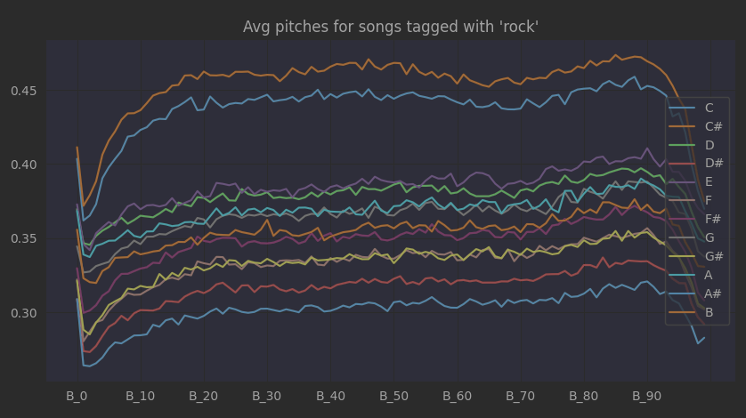

:author: Fabian H., Lea S., Andreas W., Florian W.
:listing-caption: Listing
:source-highlighter: rouge
// path to the directory containing the source code
:src: ../

:toc:
:numbered:
:toclevels: 3
:rouge-style: github
:pdf-themesdir: ./doc/theme
:pdf-theme: basic
:pdf-fontsdir: ./doc/fonts
:half-width: pdfwidth=50%
// front-cover-image can be used to include the Exercise specification, for example:
//:front-cover-image: ./Exercise1.pdf

= Spotif-A.I: A spotify genre guesser

== Introduction

Spotify itself doesn't provide genres for a particular track, only for artists.
But instead the spotify api provides different kinds of features which can be used for machine learning.
From last.fm it is possible to get the appropriate genres of a track.
We can use these genres as our target labels for our tracks.

== Data Gathering

We use following features from the spotify api:

- name: Name of the track
- duration: Track length in ms
- artist_genres: Artist genres
- acousticness: Confidence measure from 0.0 to 1.0 of whether the track is acoustic
- pitches: dominance of every pitch
- loudness: overall loudness in dB
- energy: perceptual measure of intensity and activity
- dancebility: How suitable a track is for dancing
- mode: Modality (Major or minor) of a track
- instrumentalness: Precision whether a track contains vocals
- key: Pitches using standard pitch class notation
- liveness: Presence of audience in the recording
- temp: estimated bpm
- time_signature: How many beats are in each bar
- valence: Musical positiveness

The first approach was to fetch songs via the search function of the api.
Problem is the results are limited to a few popular tracks.
The next approach was to use some large spotify playlists where all genres where included.
The loading needs to be paged because only 50 tracks can be loaded at once.

[source, python]
----
def playlist_tracks(self, playlist_id: str, offset: int = 0):
    completed = False
    limit = 50

    while not completed:
        print('loading playlist', playlist_id, 'offset:', offset)
        try:
            playlist_page: Union[PlaylistTrackPaging, dict] = self.spotify.playlist_items(
                playlist_id=playlist_id,
                offset=offset,
                limit=limit
            )
            if len(playlist_page.items) == 0:
                completed = True
            else:
                yield [item.track for item in playlist_page.items if isinstance(item.track, FullPlaylistTrack)]
                completed = False

            offset += limit
        except Exception as e:
            print('Error while fetching playlist tracks: ', e)
            completed = False
            sleep(3)

----

The genres itself get scraped from last.fm because the api provides inconsistent results.
On multiple occasions the API would return no tags, even though the web-UI shows multiple tags on a track.

[source, python]
----
def get_tags(self, artist: str, track: str) -> Set[str]:
    artist = urllib.parse.quote(artist)
    track = urllib.parse.quote(track)
    url = f"https://www.last.fm/music/{artist}/_/{track}/+tags"
    r = requests.get(url)
    tags_html = BeautifulSoup(r.content, features="html.parser")
    tag_links = tags_html.find_all("a", href=True)
    return {t.text for t in tag_links if t["href"].startswith("/tag/") and t.text != ""}
----

The data is then saved into a Mongo Atlas instance.
There are multiple reasons why an online database is used:

- Multiple teammates can load data into the database
- The charting abilities of Mongo Atlas
- Not having to have to track the data in Git

== Data preprocessing

Initially the pitches have different lengths depending on the track length and the size of the segments.
We need to unify all pitches to the same lengths and reduce the frequency.

[source, python]
----
df["pitches"] = pitches
for sym in pitch_symbol:
    df.insert(len(df.columns), f"{sym}_max", [max_of_pitches(item, sym) for item in df["pitches"]])
    df.insert(len(df.columns), f"{sym}_min", [min_of_pitches(item, sym) for item in df["pitches"]])
temp_df = pd.DataFrame()

for index, row in enumerate(df["pitches"].values):
    song = pitches_to_dataframe(row)
    song["timestamp"] = song["timestamp"].apply(pd.to_timedelta, unit='s')
    resampled: pd.DataFrame = song.set_index("timestamp").resample(
        f"{song.iloc[-1]['timestamp'].total_seconds() * 10 // 1}ms").mean().interpolate()[:100]
    d: pd.DataFrame = pd.DataFrame()
    for col in resampled.columns:
        if col == "timestamp":
            continue
        d = pd.concat([d, pd.DataFrame({f"{col}_{row_idx}": [val] for row_idx, val in enumerate(resampled[col].values)},
                                       index=[df.index[index]])], axis=1)
    temp_df = pd.concat([temp_df, d])

df = pd.concat([df, temp_df], axis=1)
df.drop(columns=["pitches"], inplace=True)  # drop unprocessed pitches
----

Additionally, the number of tags need to get reduced.
Otherwise, we have way too many targets for our machine learning models.
That's why we only used the top 10 genres of our data and set all other tags to misc.

== Data Visualization

Here you can see the distribution of our top 10 genres.

These are our different artist genres.

This is a chart of the different tags with the dancebility feature.

Average pitches and correlation matrix for rock.

image::doc/images/visualization/correlation_matrix.png[]

Average pitches for multiple genres.
For example metal is very distinguishable when looking at the c pitch.

== Model Training

=== Problems in first iteration

In our first iteration we couldn't manage to get any meaningful results.
We tried the following models with `GridSearchCV` to also include a hyperparameter search:

* tree.ExtraTreeClassifier
* neighbors.KNeighborsClassifier
* neural_network.MLPClassifier
* neighbors.RadiusNeighborsClassifier
* linear_model.RidgeClassifier

But the best we could achieve was an `accuracy` of `4%` with `19% precision`.

==== Target imbalance & too many targets

The dataset that was gathered contains some massive imbalances.
About one third of the songs contain `rock` as target and one fourth contain `pop`.
This obviously leads to problematic models, that wrongly predict rock as target.

.first iteration data imbalance
[.left]
image::doc/images/training/problems/massive-target-inbalance.png[]

Although we had over `10.000` songs, we also had `4941` tags i.e. `4941` targets.
Which essentially means we either have too many tags or not enough songs.

There are a few reasons why there is such a vast amount of target variables.
Often, genres will occur in their hyphenated form and with a dash.
For example, `hip-hop` and `hip hop`.
Other sources for useless tags are that the tags will contain the artists of a song and custom tags, that are used to map tracks to a playlist for example.
These churn tags lead to many targets that are either useless or redundant.

==== Solution

We decided to try and resolve this by restricting our targets to the `top 9`, without `rock`, appearing genres and wrap aggregate all other genres into a `misc` genre.
This was done by preprocessing the tags in our `MongoDB` instance and providing a view to further work with them.
We also added some more songs.
`Rock` was removed as target, because it is overrepresented in our dataset.
There are multiple tags, that are a subgenre of rock.
Therefore, `rock` as standalone tag was removed, but other subgenres were kept.

.top 10 genres
image::doc/images/training/problems/aggregated-targets[]

=== Training

For the training of our tuned tags, we decided to use the following models and compare there performance:

* neighbors.KNeighborsClassifier
* tree.DecisionTreeClassifier
* ensemble.ExtraTreesClassifier
* neural_network.MLPClassifier

==== Feature Preprocessing

Like always, before we start training, we create a _held-back test set_ to use as a safety line and to perform the final evaluation of our model. +
However, before we can create the held-back test set, we need to use the `MultilabelBinarizer` to transform our targets (genre tags) into numerical values so that the models can work with them. +
For good measure we also use a `StandardScaler` to scale the input data for our models, as some models tend to perform better with this.

.held-back test set
[source, python]
----
from sklearn.model_selection import train_test_split
from sklearn.preprocessing import MultiLabelBinarizer
from sklearn.preprocessing import StandardScaler

# transform tags with MultiLabelBinarizer
mlb = MultiLabelBinarizer()
y = mlb.fit_transform([*df['tags']])

X = df.drop(columns=['tags', 'artist_names', 'name', "artist_genres"])

# scale input
scaler = StandardScaler()
X = scaler.fit_transform(X)

# create held-back test set
X_train, X_test, y_train, y_test = train_test_split(X, y, test_size=0.30, random_state=234634754)  # 70/30 split
----

In order to train a `DecisionTreeClassifer`, we also needed to calculate the `class_weights` of our targets:

.class_weights calculation
[source, python]
----
import numpy as np
from collections import Counter
from sklearn.utils import class_weight
flat_labels = [label for sublist in df['tags'] for label in sublist]
label_counts = Counter(flat_labels)
class_weights = class_weight.compute_class_weight('balanced', classes=np.unique(flat_labels), y=flat_labels)
class_weights_dict = dict(zip(np.unique(flat_labels), class_weights))

# Create a list of class weight dictionaries for each label
class_weights_list = []
for i in range(y.shape[1]):
    label_column = y[:,i]
    label_counts = Counter(label_column)
    class_weights = class_weight.compute_class_weight('balanced', classes=np.unique(label_column), y=label_column)
    class_weights_list.append(dict(zip(np.unique(label_column), class_weights)))
----

==== Feature Selection

Some models can't effectively use 1241 features, so for them, we need to reduce the amount of features. +
Other models like MLP however can use all features, so we do not remove the other features.

<<<
==== KNeighborsClassifier

The KNN classifier was tested in  following configurations, the best parameters are marked bold in the table:

.GridSearchCV for KNN
|===
^|Parameter 3+^|Values

^|*weights*
^|`uniform`
2+^|*`distance`*

^|*algorithm*
^|*`ball_tree`*
2+^|`kd_tree`

^|*leaf_size*
^|*`1`*
2+^|`3`

^|*p*
^|*`1`*
^|`2`
^|`4`

^|*metric*
^|`manhattan`
^|`cosine`
^|*`euclidean`*
|===

The best KNN classifier achieved following stats:

.KNN Performance Evaluation
|===
^|Metric ^|Value

^|Accuracy
^|34%

^|Precision
^|91%

^|Recall
^|66%

^|F1-Score
^|71%
|===

.Confusion Matrix for each tag

==== DecisionTreeClassifier

NOTE: : The class weights list are the ratios in which each class occurs

The Decision Tree classifier was tested in  following configurations, the best parameters are marked bold in the table:

.GridSearchCV for DecisionTreeClassifier
[cols="2,1,1,1,1,1"]
|===
^|Parameter 5+^|Values

^|*criterion*
5+^|`gini`

^|*splitter*
2+^|`best`
3+^|`random`

^|*max_depth*
^|`1`
^|`2`
^|`8`
^|`16`
^|`48`

^|*min_samples_leaf*
^|`1`
2+^|`10`
2+^|`30`

^|*min_weight_fraction_leaf*
^|`0.0`
2+^|`0.0001`
2+^|`0.0001^10`

^|*max_features*
^|`None`
2+^|`sqrt`
2+^|`log2`

^|*max_leaf_nodes*
^|`None`
^|`10`
^|`100`
2+^|`1000`

^|*min_impurity_decrease*
^|`0.0`
2+^|`0.0001`
2+^|`0.0001^10`

^|*class_weight*
5+^|`class_weights_list`

^|*ccp_alpha*
^|`0.0`
2+^|`0.0001`
2+^|`0.0001^10`

|===

==== ExtraTreesClassifier

.ExtraTreesClassifier
[source, python]
----
from sklearn.ensemble import ExtraTreesClassifier
from sklearn.model_selection import GridSearchCV

param_grid = {
    'n_estimators': [100, 150, 200, 300, 400],
    'criterion': ['gini', 'entropy', 'log_loss'],
    'max_depth': [12, 24, 36, 48, 64],
    'min_samples_split': [2, 8, 32],
    'max_features': ['sqrt', 'log2', None],
    'n_jobs': [-2],
    'class_weight': [class_weights_list, None]
}
etc = GridSearchCV(ExtraTreesClassifier(random_state=42), param_grid)

etc.fit(X_train_pca, y_train)
----

==== MultilayerPerceptronClassifier

The last model we tried was the `MLPClassifier`.

.MLPClassifier
[source, python]
----
from sklearn.neural_network import MLPClassifier

param_grid = {
    'hidden_layer_sizes': [(150,150,150), (100,100,100), (150,200,150)],
    'activation': ['relu', 'tanh'],
    'solver': ['adam', 'lbfgs'],
    'learning_rate_init': [0.01, 0.001, 0.0001],
}
mlp = GridSearchCV(MLPClassifier(max_iter=1000), param_grid, cv=5)
mlp.fit(X_train, y_train)
mlp.best_params_
----

=== Results